# SIEM Implementation in Azure Cloud — Microsoft Sentinel Deployment

A comprehensive **Security Information and Event Management (SIEM)** system implemented using **Microsoft Sentinel** on **Azure Cloud**, designed to enhance cybersecurity visibility, threat detection, and incident response capabilities.

---

## Table of Contents

* [Project Overview](#project-overview)
* [Features](#features)
* [Architecture](#architecture)
* [Technologies & Azure Services](#technologies--azure-services)
* [Screenshots](#screenshots)
* [Getting Started](#getting-started)

  * [Prerequisites](#prerequisites)
  * [Deployment Steps](#deployment-steps)
* [Threat Detection & Response](#threat-detection--response)
* [Incident Investigation Workflow](#incident-investigation-workflow)
* [Security Considerations](#security-considerations)

---

## Project Overview

This project demonstrates the deployment and configuration of **Microsoft Sentinel**, a cloud-native SIEM solution, within the **Azure Cloud environment**. It focuses on building a scalable, automated, and intelligent security monitoring system capable of detecting and responding to threats across multiple sources.

**Objective:**

* Strengthen cloud infrastructure security posture.
* Enable real-time detection and investigation of cybersecurity incidents.
* Create automated alerts and responses using Kusto Query Language (KQL).
* Improve incident remediation and prevention processes.

---

## Features

* **Deployed Microsoft Sentinel on Azure Cloud** — providing centralized log collection, monitoring, and analysis.
* **Custom KQL Analytics Rules** — to detect suspicious patterns and potential intrusions.
* **Automated Incident Response** — playbooks using Azure Logic Apps for swift containment and remediation.
* **Threat Visualization** — dashboards for continuous monitoring of alerts and security trends.
* **Incident Investigation** — analyze alerts, correlate logs, and respond efficiently to threats.

---

## Architecture

```
[Cloud & On-Prem Sources]
        │
        ▼
[Azure Log Analytics Workspace]
        │
        ▼
[Microsoft Sentinel]
   ├── Data Connectors (Azure AD, Defender, Firewall, etc.)
   ├── KQL Analytics Rules
   ├── Incident Detection & Automation
   └── Dashboards & Workbooks
```

**Key Components:**

* **Log Analytics Workspace** — stores collected logs and telemetry data.
* **Microsoft Sentinel** — analyzes data, detects threats, and manages incidents.
* **Data Connectors** — integrate with Azure AD, Defender for Cloud, and other sources.
* **Logic Apps** — automate remediation workflows.

---

## Technologies & Azure Services

* **Microsoft Sentinel** — Cloud-native SIEM
* **Azure Log Analytics Workspace** — data ingestion and storage
* **Azure Logic Apps** — automated incident response
* **Azure Monitor** — performance and activity monitoring
* **Kusto Query Language (KQL)** — rule creation and log analysis
* **Azure Active Directory (AAD)** — identity and access integration
* **Microsoft Defender for Cloud** — advanced threat protection

---

## Screenshots

Screenshots from the Sentinel deployment and dashboard views are available in the `assets/screenshots/` directory or project documentation. 

* **Sentinel Dashboard Overview**
* **Analytics Rule Configuration (KQL)**
* **Incident Investigation View**
* **Workbook Visualization and Alerts**

```markdown
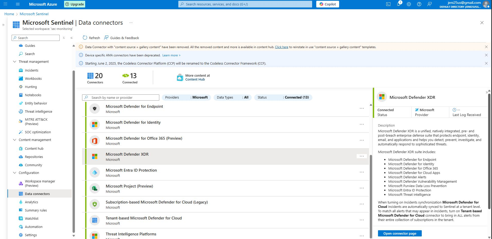
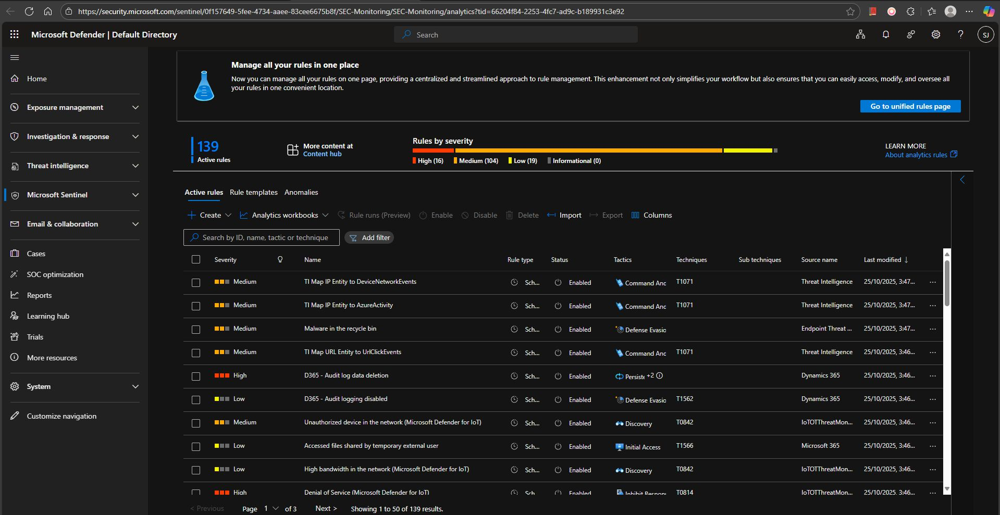
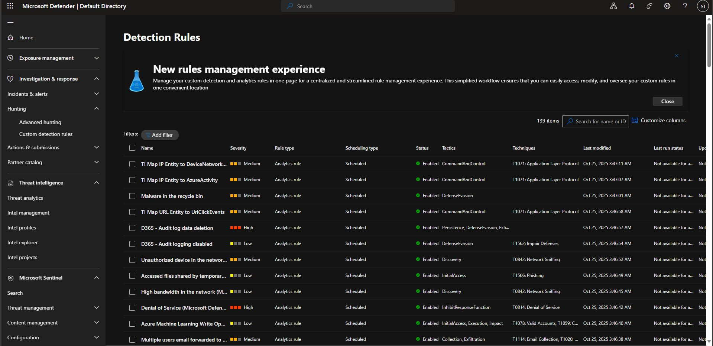
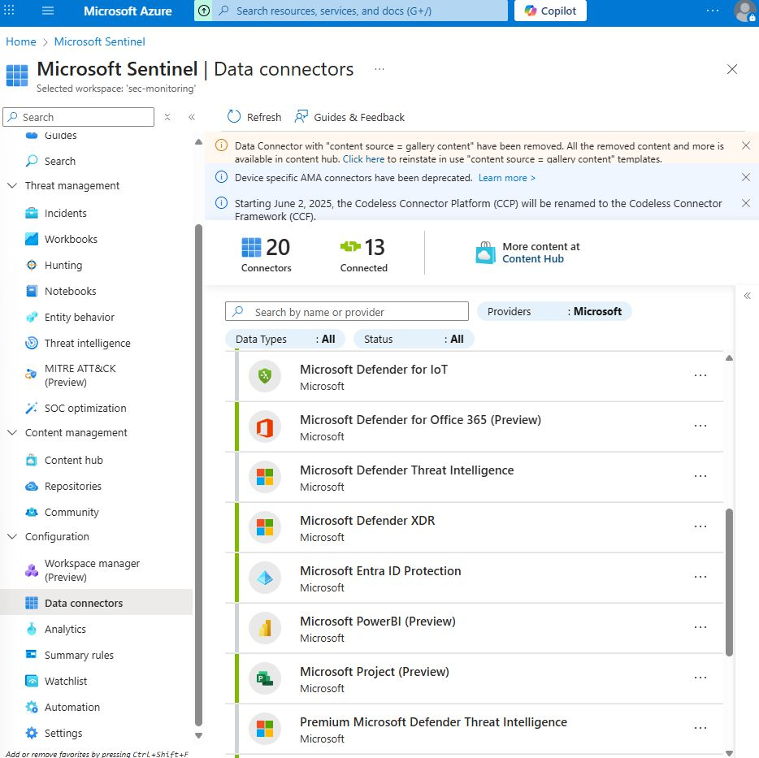
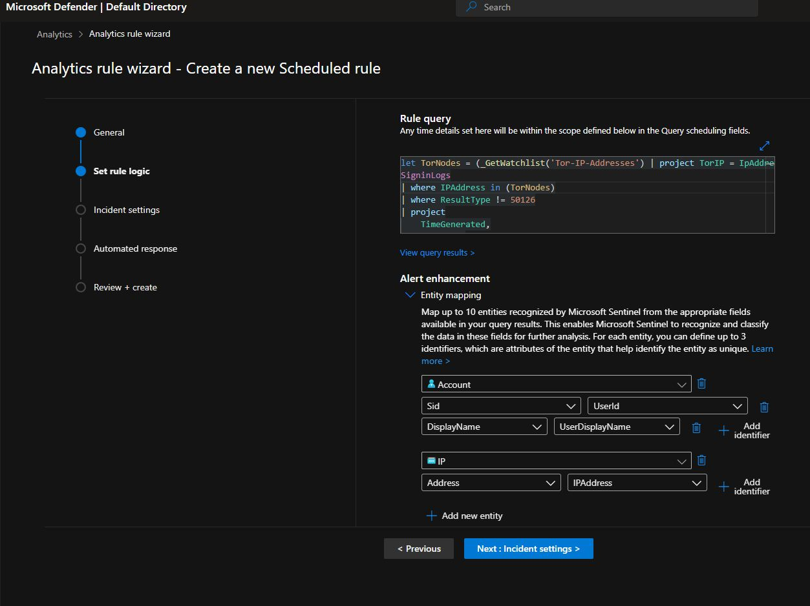
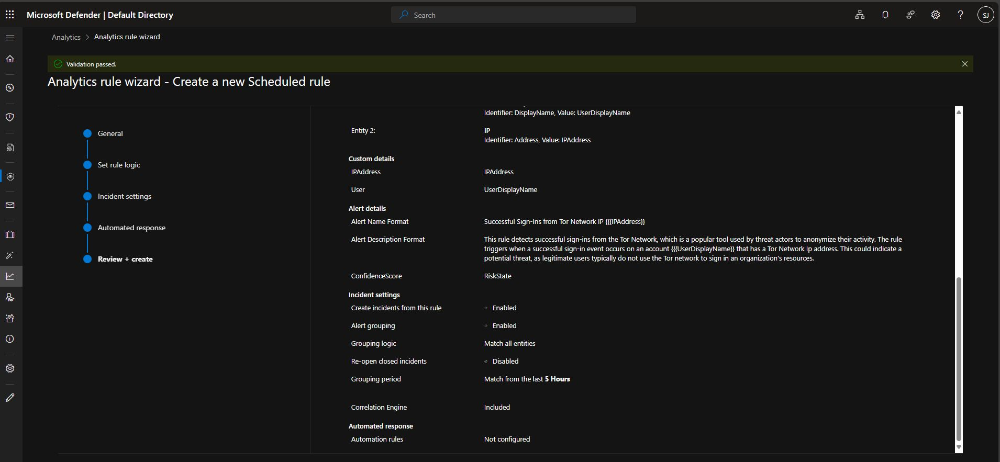
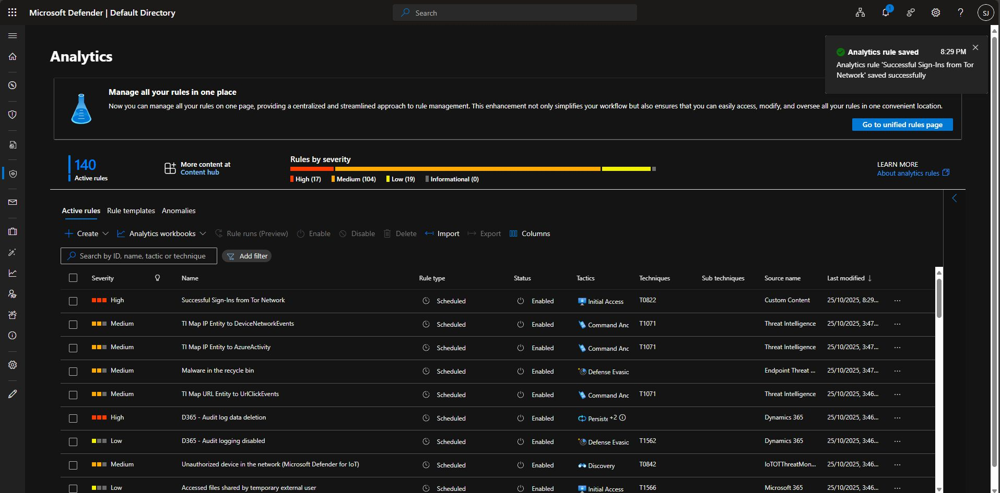
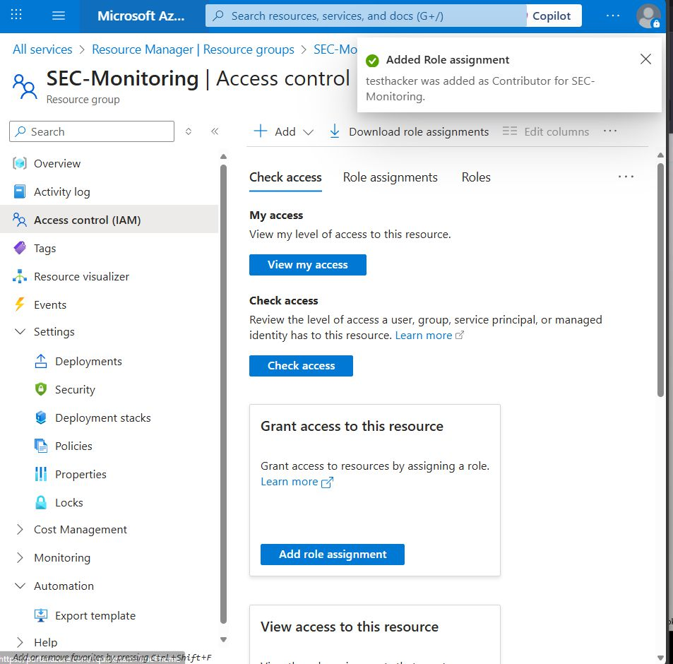
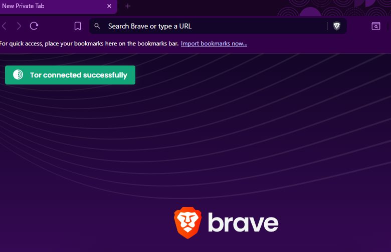
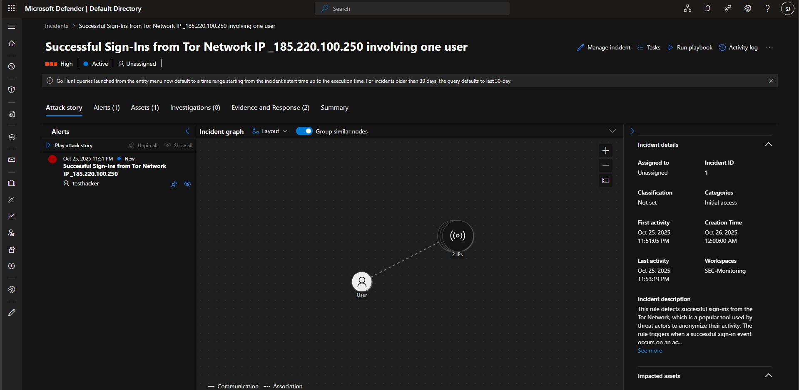
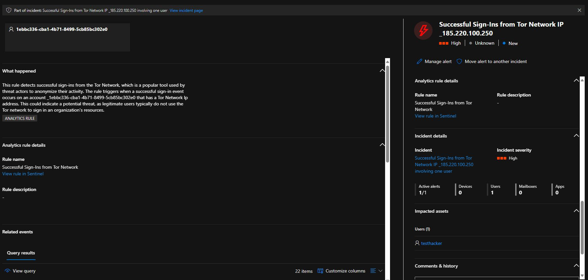
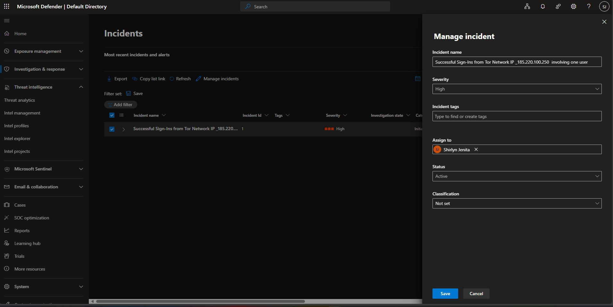
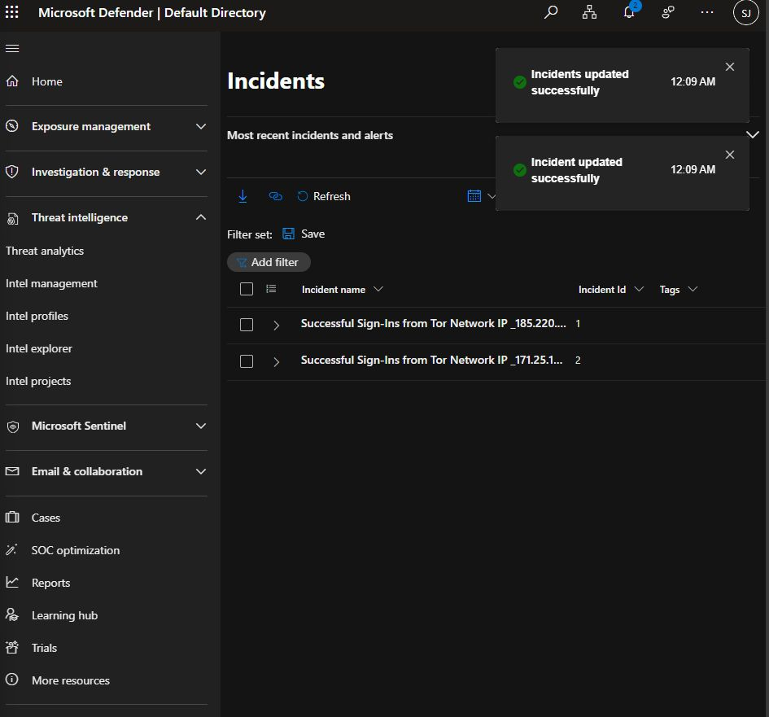
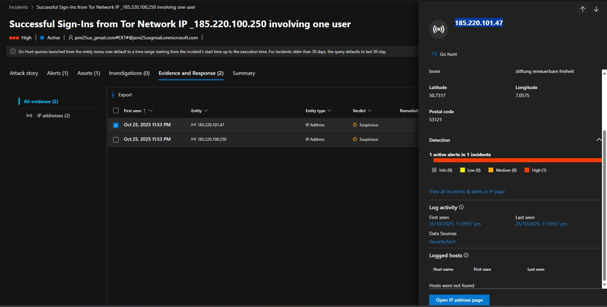
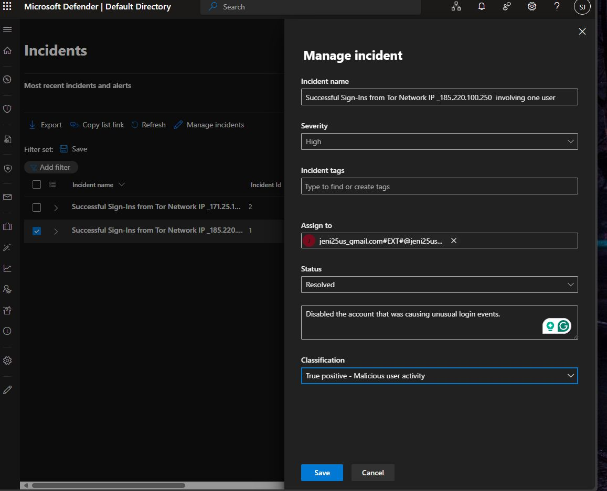
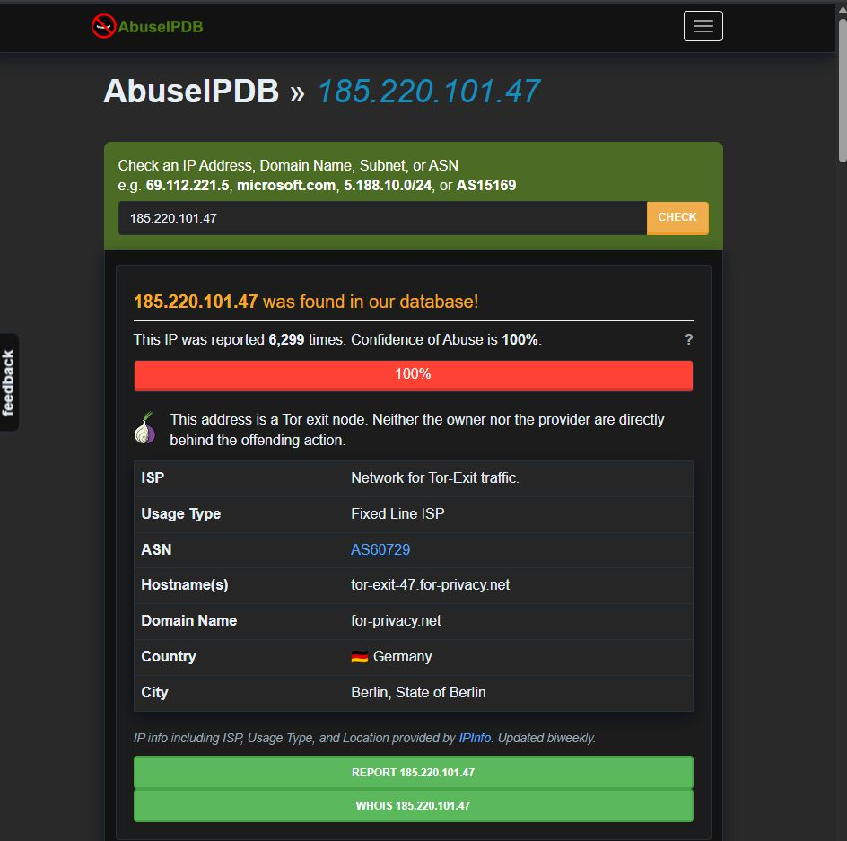


```

---

## Getting Started

### Prerequisites

* Azure subscription with permissions to deploy Sentinel and related services.
* Active Log Analytics Workspace.
* Data sources with security event logs (e.g., Azure AD, Microsoft Defender, Firewalls).
* Familiarity with Kusto Query Language (KQL).

### Deployment Steps

1. **Create a Log Analytics Workspace**

   * Navigate to Azure Portal → Create Resource → Log Analytics Workspace.
   * Configure region and resource group.

2. **Enable Microsoft Sentinel**

   * Go to Sentinel → Add → Select existing workspace.
   * Wait for deployment completion.

3. **Connect Data Sources**

   * Configure connectors for Azure AD, Microsoft 365, Defender for Cloud, etc.
   * Verify data ingestion into the workspace.

4. **Create Analytics Rules (KQL)**

   * Define custom detection queries based on activity patterns.
   * Example:

     ```kql
     SecurityEvent
     | where EventID == 4625
     | summarize Count = count() by Account, IPAddress
     | where Count > 10
     ```
   * Schedule rule execution and link to automated response playbooks.

5. **Design Workbooks and Dashboards**

   * Create visualizations to track alerts, failed logins, and active threats.

6. **Automate Incident Response**

   * Use Azure Logic Apps to trigger remediation actions (e.g., account disable, IP block).

---

## Threat Detection & Response

* Implemented multiple custom analytics rules using **KQL** to identify brute-force attempts, unusual logins, and privilege escalations.
* Configured alert thresholds and automatic escalation workflows.
* Set up **Logic App playbooks** for remediation — blocking malicious IPs, disabling compromised accounts, and alerting administrators.

---

## Incident Investigation Workflow

1. **Alert Generation:** Sentinel detects anomalies via KQL rules.
2. **Incident Correlation:** Related alerts grouped into incidents.
3. **Investigation:** Use built-in Investigation Graph to visualize event relationships.
4. **Response:** Execute playbooks or manual actions to remediate threats.
5. **Post-Analysis:** Document root cause and update rules to prevent recurrence.

---

## Security Considerations

* Use role-based access control (RBAC) to limit Sentinel access.
* Enable encryption in transit and at rest for all data.
* Regularly review analytics rules for false positives.
* Restrict data connectors to trusted resources.
* Implement alert suppression for repetitive benign events.

---


